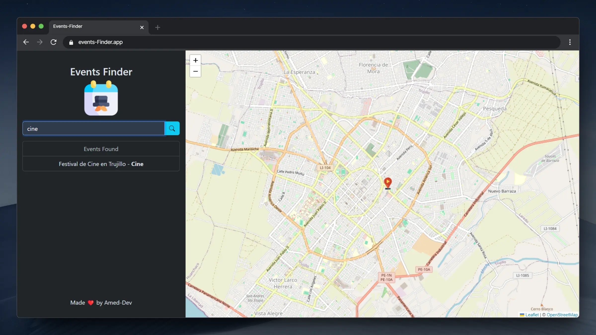

# Events Finder - Final project

## Requisitos
- Búsqueda de Eventos: Los usuarios podrán buscar eventos por ubicación (ciudad, región y/o país) y por tipo de evento (música, arte, tecnología, etc.).
- Interfaz Interactiva: El mapa interactivo mostrará marcadores de eventos. Al hacer clic en un marcador, se mostrará un cuadro emergente con información detallada del evento.

## Deploy

## Author
